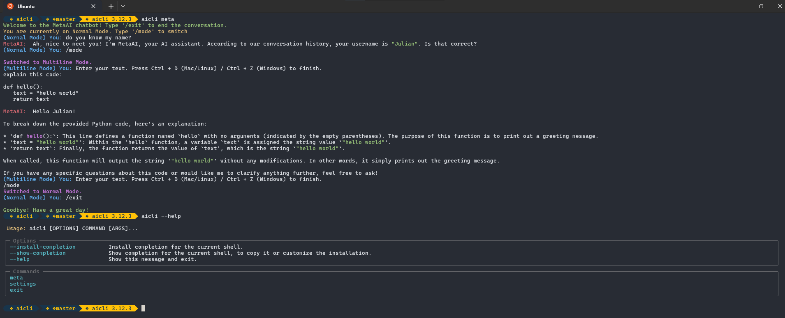

# 🧠 AI CLI – Terminal AI Assistant

AI CLI is a powerful command-line AI assistant that integrates **LLaMA 3** via Hugging Face API. It provides intelligent and context-aware responses from previous conversations directly from the terminal.



---

## 🚀 Features
✅ **Context-Aware Responses** – Remembers conversation history  
✅ **Customizable Settings** – Modify `settings.json` for fine-tuning  
✅ **Fast & Lightweight** – Works directly in the terminal  
✅ **Uses LLaMA 3 API** – Seamless integration with Hugging Face  

---

## 🛠️ Installation

### 1️⃣ Clone the Repository
```bash
git clone https://github.com/julsCadenas/AI-CLI.git
cd aicli
```

### 2️⃣ Set Up API Key
1. Get your API key from Hugging Face or LLAMA.
2. Add it to your environmental variables.

### 3️⃣ Install the application in editable mode
```bash
pip install --editable . 
```

### 4️⃣ Try the application!
```bash
aicli meta
```

## ⚙️ Customization

Modify `settings.json` to adjust parameters like:
- `temperature` (controls randomness)
- `top_p` and `top_k` (sampling diversity)
- `meta_prompt` (changes AI behavior)
